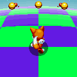

# Mania-Styled Blue Spheres

Stylizes special stages and Blue Sphere game, under the style of Sonic Mania. Replacing characters, spheres, HUD, and more with Sonic Mania. Don't forget to enable Classic style in the game options for a better look.

## List of features:

* Full-smooth animations for characters with Sonic Mania sprites.

* Replacement all types of spheres with Sonic Mania sprites, includes DAGE Green sphere.

* Replacement HUD, "Get Blue Spheres" and "Perfect" text with Sonic Mania sprites.

* Replacement ground horizont with Sonic Mania sprites, [New!] and smooth horizont for A.I.R Modern style.

* Replacement spheres SFX and Music track with Sonic Mania.

* Compatible with the Blue Sphere Plus, Blue Sphere Time Attack, Sonic 3: D.A. Garden Edition, and more.

## Mod options:

* __Stage ground render__ sets the render method for the stage ground: Smoothed (Default), Sharped.

* __Mania "picking up" rings__ enables ring collecting when the ring reaches the bottom of the character's sprite.

## Compatibility notes:

1. <a href="https://gamebanana.com/mods/54326">Yellow Emerald</a>, <a href="https://gamebanana.com/mods/322550">3D Side View Chaos Emeralds</a> can be installed in any order. Their script does not affect the work of this mod in any way, so just make them active.

2. <a href="https://gamebanana.com/mods/297356">Blue Sphere Plus</a>, <a href="https://gamebanana.com/mods/362325">Blue Sphere Time Attack</a>, <a href="https://gamebanana.com/mods/151029">Sonic 3: D.A Garden Edition</a>, <a href="https://gamebanana.com/mods/54261">Ray the Flying Squirrel</a>, <a href="https://gamebanana.com/mods/54268">Ultimate Mighty</a>, <a href="https://gamebanana.com/mods/336038">Extra Slot Ray</a>, <a href="https://gamebanana.com/mods/336038">Extra Slot Mighty</a> be sure to set them below so that the resources of this mod are in priority.

## FAQ:

Q. I noticed a bug, where can I contact?  
A. Contact me in the comments of Gamebanana, GitHub issues, or via Discord on the Sonic 3 A.I.R modding server. Try to describe the problem in more detail.